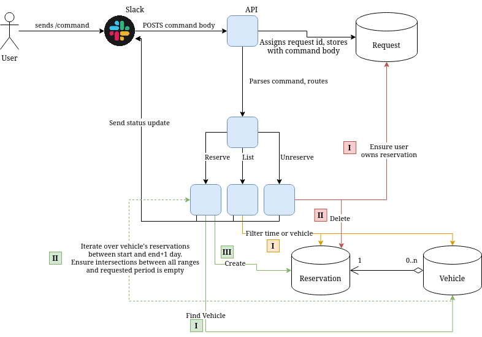

# Vehicle Reservation - Design Doc

The overall goal of this application is to provide a Slack interface for IT employees to reserve vehicles.

## Shortcomings of Previous Design

In terms of user experience, the previous implementation was not up to par:

* Integration with Outlook's calendar to schedule reservations: 
  + Requires creation of a new calendar for every single vehicle.
  + Requires maintenance of a completely seperate Outlook account, and its API tokens, with oauth.
  + Does not allow users to view the vehicle reservation calendar.

* Current Integration with Slack:
  + User does not receive feedback if the reservation system fails on the server - only "we will process
    that shortly".
  + Form does not have a saved state: if a user makes a reservation and it fails, all details have to be
    re-entered manually.
  + Requires users to "guess and check" which vehicles are available during the period they wish to reserve.
  + Does not use "slash"(/) commands, instead, requires mentions of a "user" (nitpick, but, it would be cool)

## New Design

The proposed new design will consist of a REST API to manage vehicle reservations, a frontend to provide admin
access to the reservation system, and a Slack integration to provide a convenient way to interface with the API
without opening the frontend.



### Requirements

- [ ] A user can reserve a vehicle using a /slash command.
- [ ] A user can filter vehicles by time available.
- [ ] Vehicles cannot be double-booked in the same period.
- [ ] If a request fails, form is re-sent to the user with pre-populated fields.

### Database

It has been proposed to use PostgreSQL as the DBMS.

The database might consist of four tables: 

1. A request table to store slack commands to the application
2. A vehicle table to store vehicle information
3. A reservation table referencing the vehicle table 
4. An admin table

#### Request
```
 id: primary int,
 command_name: text,
 body: text,
 response_url: text,
 user_id: text,
 user_name: text,
 channel_name: text,
```

Note that [`slack_user_id`](https://api.slack.com/interactivity/slash-commands#app_command_handling) is unique to 
the message's user.

#### Vehicle
```
 id: primary int,
 name: text,
```

#### Reservation
```
 id: primary int,
 vehicle_id: foreign int references vehicle.id,
 request_id: foreign int references request.id,
 start_day: date,
 end_day: date,
 start_time: timestamp,
 end_time: timestamp
```

#### Admin
```
 id: primary int,
 username: text unique,
 password: text (hash),
```

### API

The API is proposed to be written in TypeScript utilizing the Nest.JS framework and TypeORM as the ORM. All are
tools @Simponic has experience with.

### Frontend

The frontend is proposed to be written in React, using vanilla JS which @Simponic and @parkerfreestone have 
experience with.

Additionally, @Simponic has experience with https://fullcalendar.io/, which provides a really easy to use
drag-and-droppable calendar component with hooks to listen to user events. This will be very nice to visualize
the vehicle reservations.

## Milestones and Estimates

### M0 (1 week)
- [ ] Project initiated - simple Nest.JS routes setup and rendered with React
- [ ] Schema successfully migrated
- [ ] Admin authentication & initial portal implemented

### M1 (1.5 - 2.5 weeks)
- [ ] Users can successfully make a vehicle reservation
- [ ] Users can list their reservations
- [ ] Users can filter vehicles by periods available
- [ ] Safeguards implemented to prevent double booking
- [ ] Calendar rendering vehicle reservations

### M2 (<1 week)
- [ ] "Bug free"
- [ ] Slack app deployed to USU IT workspace
- [ ] Documentation not covered in M0 and M1 "sprints"

## Going further

For the sake of time, some features could be added in the future, which are not hard "requirements". However,
the current design is made with extensibility for these features in the future.

* Vehicles have their own slots during which they can be reserved. No reservations for that can be made unless they
  are within those periods. (Consider making a new vehicle_reservation_periods table with a one-to-many relationship)
* Some vehicles can only be reserved by certain users.
* Many to many relationship between vehicles and reservations - allowing for reservations to be composed of multiple
  vehicles at a time.

